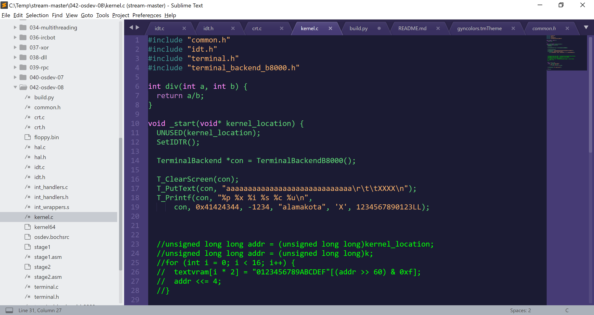

# GynColorsForSublime
Colors for Sublime Text that matches Gynvael Coldwind vim colors

The source can be found here: https://github.com/gynvael/stream/blob/master/inne/inkpot_gc.vim

More info on colors in Sublime Text: http://www.sublimetext.com/docs/3/color_schemes.html

How to install: https://docs.sublimetext.io/reference/color_schemes_legacy.html#file-format

## Current status:
Work in progress! 

Feel free to contribute.

